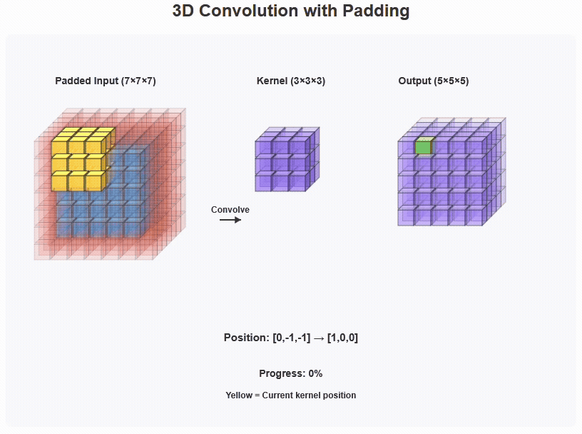
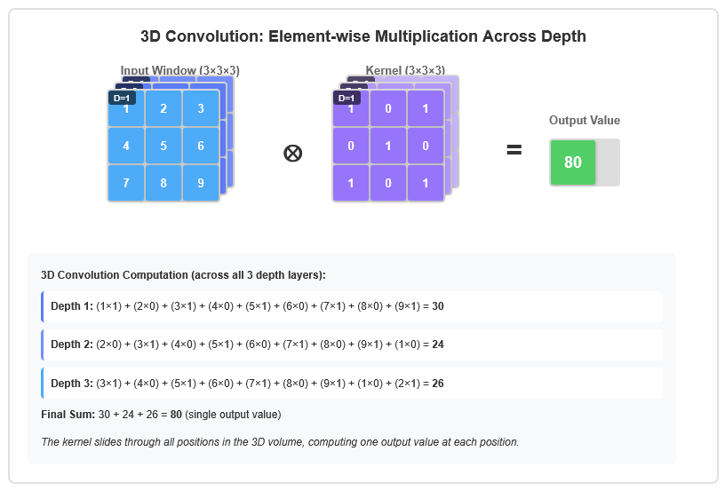

# 3D Convolution CUDA Benchmark

## Overview

This project compares several 3D convolution implementations:

* A CPU reference implementation (`convolution3DGold`)
* A naive CUDA kernel that reads the kernel and the input data from global memory
* A CUDA kernel that caches the convolution kernel in constant memory and uses tiles in shared memory 
* A CUDA implementation with separable 1D filtering

Benchmark statistics (average, median, minimum) in convolution3D are reported after multiple warm-up and measured iterations.


## Building

The project uses a standard CUDA-enabled makefile.

```bash
make
```

The resulting binaries are placed in `bin/`.

To clean the build artifacts:

```bash
make clean
```

## Running benchmarks

The main benchmark binary is `bin/convolution3D`. Run it directly to use the default configuration:

```bash
./bin/convolution3D
```

or 

```bash
make run
```

Command-line options let you tailor the benchmark to your dataset or GPU. Run `--help` to view the supported parameters:

```bash
./bin/convolution3D --help
```

### Command-line options

| Option | Description | Default |
| --- | --- | --- |
| `--width <int>` | Volume width | 128 |
| `--height <int>` | Volume height | 128 |
| `--depth <int>` | Volume depth | 8 |
| `--kernel-radius-x <int>` | Kernel radius along X (kernel width = `2 * radius + 1`) | 7 |
| `--kernel-radius-y <int>` | Kernel radius along Y (kernel height = `2 * radius + 1`) | 7 |
| `--kernel-radius-z <int>` | Kernel radius along Z (kernel depth = `2 * radius + 1`) | 7 |
| `--iterations <int>` | Number of timed iterations | 20 |
| `--warmup-iterations <int>` | Number of warm-up iterations executed before timing | 5 |
| `--block-dim-x <int>` | CUDA block dimension in X | 8 |
| `--block-dim-y <int>` | CUDA block dimension in Y | 8 |
| `--block-dim-z <int>` | CUDA block dimension in Z | 8 |
| `-h, --help` | Show usage information | — |

Example: benchmark a 256×256×32 volume with radii of 5×3×7 along X, Y, and Z, measuring 50 iterations after 10 warm-up runs and using a `16×8×4` CUDA block:

```bash
./bin/convolution3D --width 256 --height 256 --depth 32 \
    --kernel-radius-x 5 --kernel-radius-y 3 --kernel-radius-z 7 \
    --iterations 50 --warmup-iterations 10 \
    --block-dim-x 16 --block-dim-y 8 --block-dim-z 4
```

> **Notes:**
> * The kernel must fit in CUDA constant memory. Extremely large kernels will be rejected with a descriptive error.
> * The CUDA block dimensions must satisfy hardware limits (≤1024 threads per block and Z ≤ 64).

To remove build artifacts:

```bash
make clean
```


## Tests

Unit tests for the CPU and CUDA kernels live under `tests/` and require GoogleTest. Build and run them with:

```bash
make test
```

GoogleTest can be build with CMake using following commands:

```bash
git clone https://github.com/google/googletest.git
cd googletest/
mkdir build 
cd build
cmake ..
make
```


## The Algorithm: 3D Convolution

A 3D convolution applies a 3D filter, or kernel, across a 3D input volume to produce a 3D output feature map. Each output voxel is the sum of the element-wise product of the filter and the corresponding input sub-volume. This operation is computationally intensive and, depending on the implementation, can be heavily memory-bound.




### Implementation 1: `convolution3DBaseline`

The most straightforward implementation maps one thread to each output voxel. The kernel reads all required input points and filter weights directly from global memory, performs the computation, and writes the single result back to global memory. The input and kernel sized are only bounded by the the amount of the DRAM on the GPU.

*   **Kernel Logic:** Each thread calculates its global `(x,y,z)` index. It then enters a series of nested loops to iterate through the 3D filter dimensions, calculating the corresponding input data coordinates, reading the input voxel and filter weight from global memory, multiplying them, and accumulating the result.
*   **Initial Parameters:** Following the heuristics from Section VI, a 3D block shape is chosen to map threads to the output volume, ensuring coalescing along the `x`-axis. A block size of 256 is selected.
    *   `blockDim = dim3(8, 8, 4)`
    *   `gridDim` is calculated to cover the entire `(Nx, Ny, Nz)` output volume.
*   **Performance Analysis (via Nsight Compute):**
    *   **Bottleneck:** The kernel heavily memory-bound.
    *   **Memory Throughput:** The effective memory bandwidth is extremely low.
    *   **Root Cause:** The kernel exhibits abysmal data reuse. For every output point, all input voxels in the corresponding sub-volume are read from slow global DRAM. Neighboring threads read overlapping sets of data, but since each read is independent, the same data is fetched from DRAM over and over again. This results in massive, redundant global memory traffic.

### Implementation 2: Optimized Naive Convolution with Shared and Constant Memory: `convolution3DOptimized`

To address the critical lack of data reuse, the kernel is refactored to use shared memory for tiling the input data and constant memory for the filter weights.

*   **Kernel Logic:**
    1.  The small, read-only convolution filter is copied to `__constant__` memory before the kernel launch. Accesses to this memory are broadcast to threads in a warp and cached, making it highly efficient.
    2.  A 3D shared memory array is declared, large enough to hold the data for a computational tile plus a "halo" on all sides to store neighbor data.
    3.  Each thread in the block collaboratively loads a tile of the input volume from global memory into the shared memory array. This load is carefully orchestrated to be fully coalesced.
    4.  A `__syncthreads()` call ensures all data is loaded before proceeding.
    5.  Each thread then computes its output value, but now all input reads are serviced by the ultra-fast shared memory, and filter reads are serviced by the constant cache.
    6.  The final result is written back to global memory in a coalesced manner.
*   **Parameters:** To match an `8x8x4` tile, a 3D block shape is used.
    *   `blockDim = dim3(8, 8, 4)` (Total threads = 256)
*   **Performance Analysis:**
    *   **Bottleneck:** The kernel is still memory-bound, but the stall memory dependency is significantly reduced.
    *   **Memory Throughput:** The number of global memory loads has been drastically cut. Instead of multiple loads per output point, the amortized number of loads is now closer to 1. This results in a massive increase in effective memory bandwidth and overall kernel performance.

### Implementation 3: Decomposition with separable 1D convolutions `convolution3DSeparable`

For filters that are "separable," a 3D convolution can be decomposed into three consecutive 1D convolutions: one along the rows (X-axis), one along the columns (Y-axis), and one along the depth (Z-axis). This dramatically reduces the arithmetic complexity. For a `KxKxK` filter, a naive convolution requires $K^3$ multiplications per output voxel, while a separable one requires only $3 \times K$.

*   **Kernel Logic:** Three separate kernels are launched in sequence. The output of the first becomes the input to the second, and so on.
    1.  **Row Kernel (X-axis):** Reads input data, convolves along X, and writes to an intermediate buffer. This pass has perfectly coalesced memory access.
    2.  **Column Kernel (Y-axis):** Reads from the intermediate buffer, convolves along Y, and writes to a second intermediate buffer. This pass has a **strided** global memory access pattern, as consecutive threads read from different rows.
    3.  **Depth Kernel (Z-axis):** Reads from the second intermediate buffer, convolves along Z, and writes the final output. This pass also has a highly strided memory access pattern.
*   **Optimization and Parameters:**
    *   The key to performance is mitigating the strided access in the Y and Z passes. This is achieved by using shared memory to transpose the data on the fly. Each block reads a 2D tile from global memory (with strided access) into a shared memory tile (with coalesced access). After a `__syncthreads()`, threads read the data from shared memory along the desired dimension (column or depth) before performing the 1D convolution.
    *   **Block Shape:** The optimal block shape is typically 2D, such as `(32, 8, 1)`, to efficiently load 2D tiles into shared memory for the Y and Z passes.
*   **Performance Analysis:**
    *   **Bottleneck:** The performance is entirely dictated by memory bandwidth and the efficiency of the shared memory implementation for the strided Y and Z passes.
    *   **Trade-off:** While computationally far superior, a separable convolution can be slower than an optimized naive convolution if the kernel size is small (e.g., 3x3x3), because the overhead of three kernel launches and intermediate memory traffic outweighs the arithmetic savings. For larger separable kernels, this approach is significantly faster.

### Final Performance Analysis

The performance tests were conducted in Windows Subsystem for Linux with Intel Core Ultra 7 155H CPU and NVIDIA RTX 500 Ada GPU. A single random input with the size 128x128x8 was convolved with 7x7x7 random kernel and median executions times of 20 test runs after 5 warmup runs for each implementation are reported below.

| Implementation | Key Feature | Median time (ms) | Primary Limiter |
|---|---|---|---|
| `convolution3DGold` | Baseline single-thread CPU processing | 5616.53 | Slow sequential processing |
| `convolution3DBaseline` | Direct Global Memory Access | 2.67674 | Redundant Global Memory Access |
| `convolution3DOptimized` | Shared/Constant Memory Tiling | 1.04858 | Global Memory Latency (Tile Loading) |
| `convolution3DSeparable` | Three 1D Passes | 0.56832 | Strided Global Memory Access (Y/Z passes) |


## Code organization

| Path | Description |
| --- | --- |
| `src/` | CUDA and C++ sources for the benchmark executable and helper routines. |
| `tests/` | GoogleTest-based unit tests that validate the CPU and CUDA kernels. |
| `bin/` | Build output directory containing compiled binaries such as `convolution3D`. |
| `Convolution3D.html` | Interactive visualization for 3D convolution operation. |